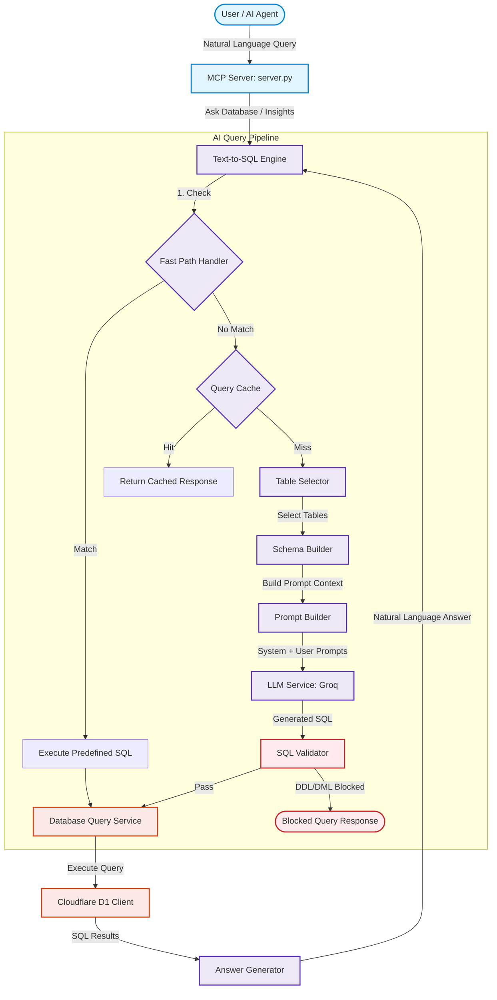

# 🚀 Minori HRMS MCP Server

Enterprise-grade Model Context Protocol (MCP) server for HRMS analytics, KPI intelligence, workforce insights, and autonomous AI agents. Built with FastAPI, Cloudflare D1, and Groq LLM pipelines.

---

## 🗺️ System Architecture

This repository facilitates natural language querying over relational HRMS databases using a structured Text-to-SQL translation and verification pipeline.



---

## ⚡ Core Features

- **Model Context Protocol (MCP)**: Exposes database operations, timesheet importers, and natural language analytics as interoperable tools.
- **Robust Text-to-SQL Translation**: Multi-stage pipeline featuring schema scoping, validation, and Groq-powered natural language answers.
- **SQL Validation Guardrails**: Restricts DDL/DML mutation keywords (`DROP`, `DELETE`, `UPDATE`, `ALTER`, etc.) to enforce read-only execution.
- **High-Performance Query Cache**: In-memory caching layer to speed up identical questions and optimize token consumption.
- **Fast-Path Pattern Matching**: Bypasses LLM generation for standard administration queries (e.g., table lists, employee counts, department listings).
- **FastAPI Web endpoints**: REST API layer for programmatic employee operations and swagger documentation.

---

## 🛠️ Getting Started

### 1. Prerequisites & Environment Setup

Configure the development environment using Python 3.12:

```bash
# 1. Create a virtual environment
python -m venv venv

# 2. Activate the virtual environment
# On Windows PowerShell:
.\venv\Scripts\Activate.ps1
# On Windows CMD:
.\venv\Scripts\activate.bat
# On macOS/Linux:
source venv/bin/activate

# 3. Install required dependencies
pip install -r requirements.txt
pip install pytest
```

### 2. Configuration

Copy the `.env.example` file to `.env` and populate your credentials:

```bash
cp .env.example .env
```

Ensure the following variables are configured:
*   `D1_DATABASE_ID`: Cloudflare D1 database ID.
*   `D1_API_TOKEN`: Cloudflare client API token.
*   `D1_ACCOUNT_ID`: Cloudflare Account ID.
*   `GROQ_API_KEY`: API Key for Groq Cloud.

---

## 📋 Running the Application & MCP Tools

### 1. Running the MCP Server
Launch the MCP server directly using Python:
```bash
python -m src.mcp_server.server
```

### 2. Testing with MCP Inspector
Inspect the server capabilities and interact with exposed tools using the browser-based `@modelcontextprotocol/inspector`:
```bash
npx -y @modelcontextprotocol/inspector venv/Scripts/python -m src.mcp_server.server
```
Once loaded, you can run tools like:
- `list_tables`: Enumerate tables.
- `ask_database`: Query the database in natural language.
- `load_timesheets`: Load CSV/Excel exports.
- `hr_insights`: Ask specific department/rework performance metrics.

### 3. FastAPI Web Server
Expose REST API endpoints for employee lookups and Swagger UI:
```bash
python -m uvicorn src.api.app:app --reload
```
Once started, open [http://127.0.0.1:8000/docs](http://127.0.0.1:8000/docs) in your browser.

---

## 🧪 Testing & Validation

### 1. Run Unit Tests
Run the test suite using `pytest`:
```bash
python -m pytest tests/unit
```

### 2. Run the Benchmark Suite
Evaluate Text-to-SQL translation adherence, Fast-Path triggers, cache performance, and validation security:
```bash
python -m tests.run_benchmarks
```
The reports are stored in `tests/benchmark_results/latest.json`.