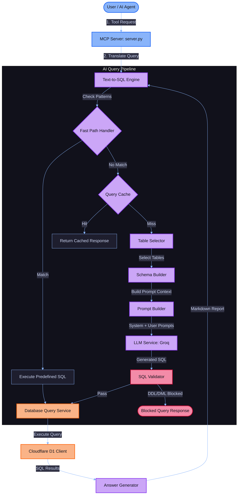

# 📊 HRMS Analytics MCP Server

<div align="center">

[](https://python.org)
[](https://modelcontextprotocol.io)
[](https://cloudflare.com)
[](https://groq.com)
[](https://github.com/tobymao/sqlglot)
[](https://docs.pytest.org)

<p align="center">
  <strong>An enterprise-grade Model Context Protocol (MCP) server for HRMS analytics, workforce intelligence, and autonomous HR agents.</strong>
  <br />
  Enables any MCP client (Claude Desktop, Cursor, and custom agent systems) to securely explore relational data, perform deep KPI analytics, sync with Google Sheets, and run conversational memory-enabled agents.
</p>

---

[🗺️ Architecture](#-system-architecture) • [📂 Project Structure](#-project-directory-structure) • [🗜️ Exposed Tools](#%EF%B8%8F-exposed-mcp-tools) • [🗄️ Schema Model](#%EF%B8%8F-database-schema--data-model) • [🛠️ Getting Started](#%EF%B8%8F-getting-started) • [📋 Running the Server](#-running-the-mcp-server) • [🔌 Claude Setup](#-claude-desktop-configuration) • [🛡️ Security](#%EF%B8%8F-sql-validation-guardrails) • [📊 Google Sheets](#-google-sheets-integration)

</div>

---

## 🗺️ System Architecture

The server translates natural language queries into safe, optimized SQLite plans via a structured, multi-layer validation pipeline.



### ⚡ Data & Execution Pipeline Details

*   **Fast-Path Evaluation**: The `FastPathHandler` scans queries for common keywords (e.g., `"how many employees"`, `"count staff"`). Matches bypass the LLM and run direct SQLite queries in **<5ms**.
*   **Query Caching**: Stores previous natural language questions and database responses in memory. Cache hits return instantly, bypassing LLM costs and latency.
*   **Business Dictionary Mapping**: Automatically resolves company-specific terminology (e.g., **FTR** mapping to `ftr_flag`, and **Rework** mapping to `rework_flag`) during prompt construction.
*   **Response Synthesis**: The `AnswerGenerator` converts raw DB record arrays into narrative summaries, complete with formatted Markdown tables.

---

## 📂 Project Directory Structure

```text
analytics-mcp/
├── data/                       # Datasets, imports, and database seeds
│   ├── imports/                # Runtime target directory for CSV/Excel timesheet imports
│   └── seed/                   # Pre-defined mock database records
├── docs/                       # Architecture diagrams and design documentation
├── infra/                      # Cloudflare configurations and infrastructure deployment scripts
├── logs/                       # Application runtime and error logs
├── scripts/                    # Command-line diagnostics and configuration assistants
├── src/                        # Primary source directory
│   ├── agent/                  # Autonomous ReAct agent and conversation memory
│   │   ├── conversation_memory.py  # Sliding conversation context window
│   │   ├── hr_agent.py             # LangChain/LangGraph agent routine
│   │   └── run_agent.py            # Local agent execution runner
│   ├── core/                   # Configurations, exceptions, and logger initializations
│   ├── mcp_server/             # Model Context Protocol registration and runner
│   │   └── server.py           # Core MCP server launcher
│   ├── schemas/                # Data verification and request validation schemas
│   ├── services/               # Underlying business logic
│   │   ├── ai/                 # Text-to-SQL logic, validator, cache, and LLM
│   │   ├── analytics/          # HR KPIs, employee utilization, rework, and FTR rates
│   │   └── database/           # D1 client connection pool and repository services
│   └── tools/                  # FastMCP modular tool declarations
│       ├── db_tools.py         # Schema inspections, raw SQL, and cache management
│       ├── employee_tools.py   # Roster lookup and search utilities
│       ├── hr_tools.py         # Advanced analytical routing and agent tools
│       ├── sheet_tools.py      # Google Sheets connection and fetching layers
│       └── timesheet_tools.py  # Local CSV/Excel data loaders
└── tests/                      # Testing & benchmarking suites
    ├── unit/                   # Unit test suite (pytest)
    ├── benchmark_queries.json  # Reference queries and validation metrics
    └── run_benchmarks.py       # Query translation evaluation runner
```

---

## 🗜️ Exposed MCP Tools

The server exposes **18 highly specialized tools** across four primary functional areas:

### 🌐 1. Database Exploration & SQL Tools
| Tool Name | Parameters | Returns | Description |
| :--- | :--- | :--- | :--- |
| `list_tables` | *None* | `list \| dict` | Lists all relational tables present in the database. |
| `describe_table` | `table_name: str` | `dict` | Retrieves columns, data types, and primary/foreign keys. |
| `execute_sql` | `sql: str` | `list \| dict` | Executes raw SQL SELECT statements securely (read-only). |
| `ask_database` | `question: str` | `dict` | Translates natural language to SQLite, runs query, and yields summary. |
| `cache_stats` | *None* | `str \| dict` | Returns hits, misses, size, and hit-rate of the translation cache. |

### 👥 2. Employee Lookup Tools
| Tool Name | Parameters | Returns | Description |
| :--- | :--- | :--- | :--- |
| `get_all_employees` | *None* | `list \| dict` | Returns the entire registered employee roster. |
| `get_employee_by_id`| `employee_id: str` | `dict \| None`| Finds detailed profile metrics by specific ID (e.g., `EMP0001`). |
| `get_employees_by_department` | `department: str` | `list \| dict` | Lists employees assigned to the given department. |
| `search_employees` | `keyword: str` | `list \| dict` | Performs a fuzzy search across names, emails, roles, and depts. |

### 📈 3. HR Analytical & Agentic Tools
| Tool Name | Parameters | Returns | Description |
| :--- | :--- | :--- | :--- |
| `hr_insights` | `question: str` | `str \| dict` | Resolves dates and routes query to optimized analytics functions. |
| `hr_agent` | `question: str`, `session_id: str` | `dict` | Runs a multi-step ReAct agent using persistent sliding memory. |
| `clear_session` | `session_id: str = "default"` | `str \| dict` | Clears conversation context memory for the given session ID. |
| `health_groq` | *None* | `dict` | Verifies connection, API keys, and model checks for Groq LLM. |

### 🔌 4. Data Integration & Loaders
| Tool Name | Parameters | Returns | Description |
| :--- | :--- | :--- | :--- |
| `connect_google_sheet` | `sheet_url: str` | `dict` | Links a sheet URL, infers table types, builds table, and imports rows. |
| `fetch_sheet_data` | `spreadsheet_id: str?`, `sheet_url: str?`, `worksheet_name: str?`, `max_rows: int` | `dict` | Fetches live row data as dictionaries from a specific worksheet. |
| `import_sheet_data` | `spreadsheet_id: str?`, `worksheet_title: str?`, `table_name: str?`, `overwrite: bool` | `dict` | Drops/creates a custom D1 table and imports active sheet rows. |
| `health_google_sheets` | *None* | `dict` | Validates API client authentication, OAuth keys, and refresh tokens. |
| `load_timesheets` | `file_path: str` | `str \| dict` | Parses local Excel/CSV timesheets into the database. |

---

## 🗄️ Database Schema & Data Model

The relational D1 schema models employee structures, daily task logging, and performance analytics:

### 1. `employees` (Roster Database)
Contains basic staff profiles, departments, and payroll indicators.
*   🔑 **`employee_id`** `<kbd>TEXT</kbd>` (Primary Key): Unique employee ID (e.g., `EMP0001`).
*   `first_name` `<kbd>TEXT</kbd>` (Not Null)
*   `last_name` `<kbd>TEXT</kbd>` (Not Null)
*   `email` `<kbd>TEXT</kbd>` (Unique): Official company email.
*   `department` `<kbd>TEXT</kbd>` (Indexed): E.g., `Engineering`, `Product`, `QA`, `Design`.
*   `job_title` `<kbd>TEXT</kbd>`: Role title.
*   `employment_type` `<kbd>TEXT</kbd>`: `FULL_TIME` or `CONTRACTOR`.
*   `date_of_joining` `<kbd>TEXT</kbd>`: ISO joining format (`YYYY-MM-DD`).
*   `annual_salary_inr` `<kbd>INTEGER</kbd>`: Annual base compensation in INR.
*   `manager_id` `<kbd>TEXT</kbd>`: Self-referencing link back to manager's `employee_id`.
*   `status` `<kbd>TEXT</kbd>`: Active employee filter (`ACTIVE`, `INACTIVE`).

### 2. `timesheets` (Frictional Task Logs)
Granular logs tracking daily project delivery, estimates, and quality flags.
*   `employee_id` `<kbd>TEXT</kbd>` (Foreign Key ➔ `employees.employee_id`)
*   `employee_name` `<kbd>TEXT</kbd>`: Employee display name.
*   `task_name` `<kbd>TEXT</kbd>`: Name of task.
*   `task_status` `<kbd>TEXT</kbd>`: E.g., `COMPLETED`, `IN_PROGRESS`, `BLOCKED`.
*   `eta_hours` `<kbd>REAL</kbd>`: Initial developer estimate (hours).
*   `actual_hours` `<kbd>REAL</kbd>`: Real time spent (hours).
*   `ftr_flag` `<kbd>INTEGER</kbd>`: First Time Right flag (`1` = delivered without rework, `0` = required fixes).
*   `rework_flag` `<kbd>INTEGER</kbd>`: Rework flag (`1` = required rework, `0` = no rework).
*   `completion_date` `<kbd>TEXT</kbd>`: ISO task completion timestamp.
*   `month` `<kbd>INTEGER</kbd>`: Numeric month (1-12).
*   `year` `<kbd>INTEGER</kbd>`: Calendar year.

### 3. `timesheet_summary` (Aggregated Performance KPIs)
Monthly pre-compiled metrics computed per employee for fast analytics.
*   `employee_name` `<kbd>TEXT</kbd>`
*   `role` `<kbd>TEXT</kbd>`
*   `month` `<kbd>TEXT</kbd>`: Named month (e.g., `April`).
*   `total_tasks` `<kbd>INTEGER</kbd>`: Total tasks worked.
*   `total_hours` `<kbd>REAL</kbd>`: Cumulative logged hours.
*   `rework_tasks` `<kbd>INTEGER</kbd>`: Reworked task count.
*   `utilization_percentage` `<kbd>REAL</kbd>`: Rate of hours spent on active tasks.

### 4. `task_logs` (Estimation Metadataset)
Historical developer entries including confidence ratings for task estimates.
*   `employee_name` `<kbd>TEXT</kbd>`
*   `role` `<kbd>TEXT</kbd>`
*   `task_description` `<kbd>TEXT</kbd>`
*   `actual_hours` `<kbd>REAL</kbd>`
*   `eta` `<kbd>TEXT</kbd>`
*   `confidence` `<kbd>TEXT</kbd>`: E.g., `HIGH`, `MEDIUM`, `LOW`.

---

## 🛡️ SQL Validation Guardrails

To prevent query exploits or accidental database drops, all SQL queries (whether generated by the LLM or supplied to `execute_sql`) pass through a strict **Abstract Syntax Tree (AST)** validation pipeline powered by `SQLGlot`:

```
          [ Natural Language / Raw SQL Query ]
                          │
                          ▼
             [ sqlglot.parse(sqlite) ]
                          │
        ❌ SQL Syntax Fail ➔ [ Return Parse Error ]
                          │
                          ▼
            [ AST Statement Type Checks ] 
           * Only Select and With allowed
           * No Insert, Update, Delete, Drop, Alter, Create
                          │
       ❌ Mutating Query Detected ➔ [ Raise Validation Error ]
                          │
                          ▼
         [ Schema Integrity & Scope Check ]
           * Resolve CTE aliases
           * Verify tables exist in D1
           * Verify columns exist in target tables
                          │
        ❌ Unknown Column/Table ➔ [ Raise Validation Error ]
                          │
                          ▼
               [ Complexity Cap Checks ]
           * Detect Join Count (Limit: 5)
           * Detect Nested Subqueries (Limit: 3)
                          │
      ❌ Complexity Threshold Reached ➔ [ Raise Complexity Error ]
                          │
                          ▼
            [ SAFE SQLite Execution in D1 ]
```

### 🚫 Blocked Query Payload Example
If an agent attempts to execute: `DELETE FROM employees WHERE employee_id = 'EMP0001'`

The tool responds immediately:
```json
{
  "error": "SQLValidationError: Statement type Delete is not permitted",
  "tool": "execute_sql"
}
```

---

## 💡 Practical Integration Examples

Here is how the server handles tool inputs and structures responses.

### 1. Database translation (`ask_database`)
**Request:**
```json
{
  "question": "Which employees in Engineering earn more than 1,000,000 INR?"
}
```
**Response:**
```json
{
  "generated_sql": "SELECT employee_id, first_name, last_name, annual_salary_inr FROM employees WHERE department = 'Engineering' AND annual_salary_inr > 1000000 AND status = 'ACTIVE';",
  "rows_returned": 2,
  "execution_time_ms": 14.2,
  "structured_data": [
    {"employee_id": "EMP0012", "first_name": "Aarav", "last_name": "Sharma", "annual_salary_inr": 1200000},
    {"employee_id": "EMP0019", "first_name": "Mira", "last_name": "Patel", "annual_salary_inr": 1050000}
  ],
  "answer": "There are 2 active employees in the Engineering department earning over 1,000,000 INR:\n\n1. **Aarav Sharma** (EMP0012) - 1,200,000 INR\n2. **Mira Patel** (EMP0019) - 1,050,000 INR"
}
```

### 2. Autonomous Multi-Step Reasoning (`hr_agent`)
**Request:**
```json
{
  "question": "Identify which department had the worst rework rate last month, and list their active staff.",
  "session_id": "session_889"
}
```
**Response:**
```json
{
  "answer": "Based on analysis of last month's performance data, the QA department had the highest rework rate of **24.5%**. Here is a list of the active staff in QA:\n\n* **Dev Bajpai** (EMP0091) - QA Engineer\n* **Neha Sen** (EMP0093) - Senior QA Specialist",
  "steps": [
    "Parsed last month as June 2026.",
    "Executed query to rank departments by rework rate (rework tasks / total tasks). QA ranked highest with 24.5%.",
    "Fetched active employees in the QA department."
  ],
  "tools_used": ["hr_insights", "get_employees_by_department"]
}
```

---

## 🛠️ Getting Started

### 1. Installation

Set up Python 3.12 (or higher) and create a virtual environment:

```bash
# Clone the repository
git clone https://github.com/Dakshin10/hrms-mcp.git
cd hrms-mcp

# Create a virtual environment
python -m venv venv

# Activate the virtual environment
# On Windows (PowerShell):
.\venv\Scripts\Activate.ps1
# On Windows (CMD):
.\venv\Scripts\activate.bat
# On macOS/Linux:
source venv/bin/activate

# Install dependencies
pip install -r requirements.txt
pip install pytest
```

### 2. Configure Environment Variables

Copy the sample environment configuration file:

```bash
cp .env.example .env
```

Open `.env` and fill in your Cloudflare and Groq developer API tokens:

```env
D1_DATABASE_ID=your_cloudflare_d1_database_id
D1_API_TOKEN=your_cloudflare_d1_api_token
D1_ACCOUNT_ID=your_cloudflare_d1_account_id
GROQ_API_KEY=your_groq_api_key
DEBUG_MODE=False
```

---

## 📋 Running the MCP Server

You can run the server locally in either **Stdio** or **SSE** transport modes:

### Option A: Standard Stdio Transport (Default)
Best for direct integrations with local client terminals (Claude Desktop, Cursor):

```bash
python -m src.mcp_server.server
```

### Option B: Server-Sent Events (SSE) Transport
Enables network access. The server runs as an HTTP service streaming event data:

```bash
# On Windows (PowerShell):
$env:MCP_TRANSPORT="sse"
$env:MCP_PORT="8000"
$env:MCP_HOST="0.0.0.0"
python -m src.mcp_server.server

# On macOS/Linux:
MCP_TRANSPORT=sse MCP_PORT=8000 MCP_HOST=0.0.0.0 python -m src.mcp_server.server
```
*Once running, clients can connect to the event stream at `http://localhost:8000/sse` and POST payloads to `http://localhost:8000/message`.*

---

## 🔌 Claude Desktop Configuration

To link this server to Claude Desktop, update your configuration file.
*   **Windows:** `%APPDATA%\Claude\claude_desktop_config.json`
*   **macOS:** `~/Library/Application Support/Claude/claude_desktop_config.json`

Add the following block under `mcpServers`:

```json
{
  "mcpServers": {
    "hrms-analytics-mcp": {
      "command": "C:/path/to/hrms-mcp/venv/Scripts/python",
      "args": ["-m", "src.mcp_server.server"],
      "env": {
        "D1_DATABASE_ID": "your_d1_database_id",
        "D1_API_TOKEN": "your_d1_api_token",
        "D1_ACCOUNT_ID": "your_d1_account_id",
        "GROQ_API_KEY": "your_groq_api_key",
        "DEBUG_MODE": "False"
      }
    }
  }
}
```

> [!IMPORTANT]
> *   Make sure to replace `C:/path/to/hrms-mcp` with the absolute path to your repository.
> *   Use forward slashes (`/`) even on Windows platforms in the JSON config.
> *   Ensure API credentials match your live environment.

---

## 📊 Google Sheets Integration

The Analytics MCP server supports secure, authenticated sync operations directly with Google Sheets.

```
 [ Google Sheets API Console ]          [ Local Server Environment ]
              │                                      │
              ▼                                      ▼
    [ OAuth 2.0 Credentials ]  ➔  Write to [ credentials/client_secret.json ]
                                                     │
                                                     ▼
                                          [ First Tool Invocation ]
                                                     │
                                                     ▼
                                        [ OAuth Browser Handshake ]
                                                     │
                                                     ▼
                                          [ credentials/token.json ]
```

### 1. Setup Google OAuth Credentials
1. Go to the **Google Cloud Console**, create a project, and enable the **Google Sheets API** and **Google Drive API**.
2. Configure your OAuth Consent Screen, add your email as a test user, and create an **OAuth 2.0 Desktop Client ID**.
3. Download the JSON credentials file, rename it to `client_secret.json`, and place it in the project root:
   ```text
   credentials/client_secret.json
   ```
   *(The `credentials/` folder is ignored by git via `.gitignore` to prevent secret exposure.)*

### 2. Authorization Flow
*   When you execute `connect_google_sheet` or `import_sheet_data` for the first time, a local web server starts and your default browser opens the Google OAuth consent page.
*   Once authorized, the server automatically writes `credentials/token.json`.
*   Subsequent tool calls run silently, refreshing tokens in the background as needed.

---

## 🧪 Testing & Validation

### 1. Run Unit Tests
Verify functional classes, services, and schemas using `pytest`:

```bash
# On Windows:
venv/Scripts/python -m pytest tests/unit

# On macOS/Linux:
venv/bin/python -m pytest tests/unit
```

### 2. Run query benchmarks
Evaluate Text-to-SQL accuracy, response latencies, cache performance, and validator rules:

```bash
python -m tests.run_benchmarks
```

Detailed metrics outputs are generated and saved to `tests/benchmark_results/latest.json`.

---

## 🛠️ Troubleshooting

| Issue | Reason | Fix |
| :--- | :--- | :--- |
| **`GROQ_API_KEY missing`** | Groq client cannot initialize. | Verify that the `.env` file exists and that the terminal running the server has the keys loaded. |
| **`SQLValidationError: Unknown column`** | Column name is misspelled or missing from the schema. | Run `describe_table` to verify column names. The AI translator occasionally hallucinates schema details for complex queries. |
| **`OAuth consent screen blocked`** | Desktop authorization has not completed or has expired. | Delete `credentials/token.json` and call `connect_google_sheet` again to re-trigger the browser authentication flow. |
| **`Access Denied: Path outside base`** | File loader security restriction. | Ensure Excel/CSV files are placed inside `./data/imports` before using `load_timesheets`. |